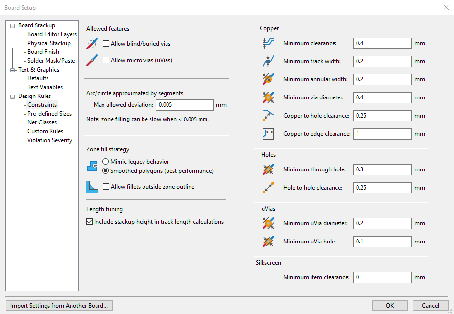
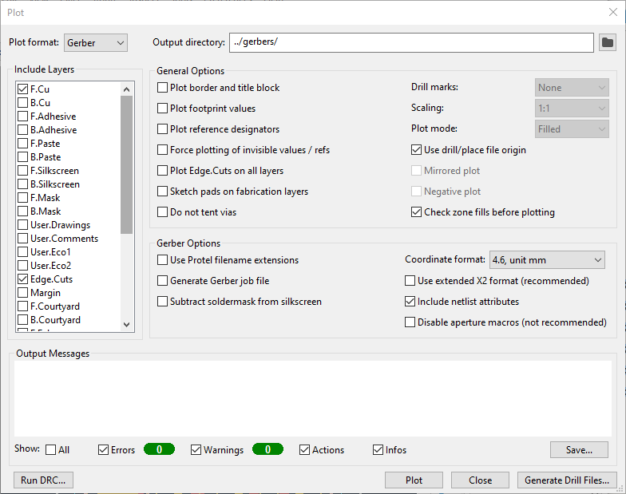
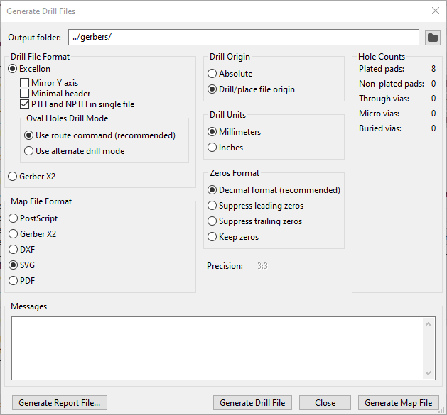

# Generating Gerbers Using KiCAD

In this tutorial, we're going to make a simple breakout board for an ATtiny85. You can find the KiCAD project [here](/example/PCB/).

If you want to skip this step because you don't have KiCAD installed, you can find the generated gerbers files [here](/example/gerbers/).

If you're using different PCB design software, you can probably adapt the settings below for your software. If you want to contribute settings for your software, pull requests are welcome!

## DRC Constraints

Below are the DRC rules we recommend for projects designed to be made on the Denford. If you're using your own design, you can import the design rules from the example project to save yourself some time.

## Gerber Generation Settings

Below are the recommended gerber generation settings for gettings gerbers compatible with pcb2gcode. Remember to set a sensible drill/place origin in your design.

For the drill file, it's best to combine all of the drill hits into one file (as we can#t do plated through holes anyway).

Once your gerber files are generated, you should have a set of files similar to the example ones [here](/example/gerbers/). The next step is to use pcb2gcode to convert our gerber files into GCode that we can use to drive the Denford.
___
  <[Previous](denfordengraver.md) | [Index](index.md) | [Next](pcb2gcode.md)>
