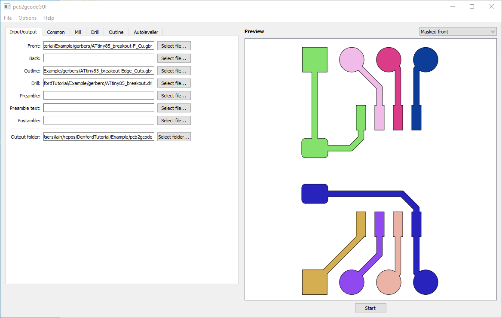
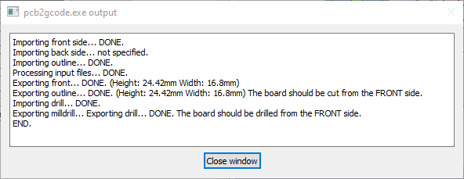
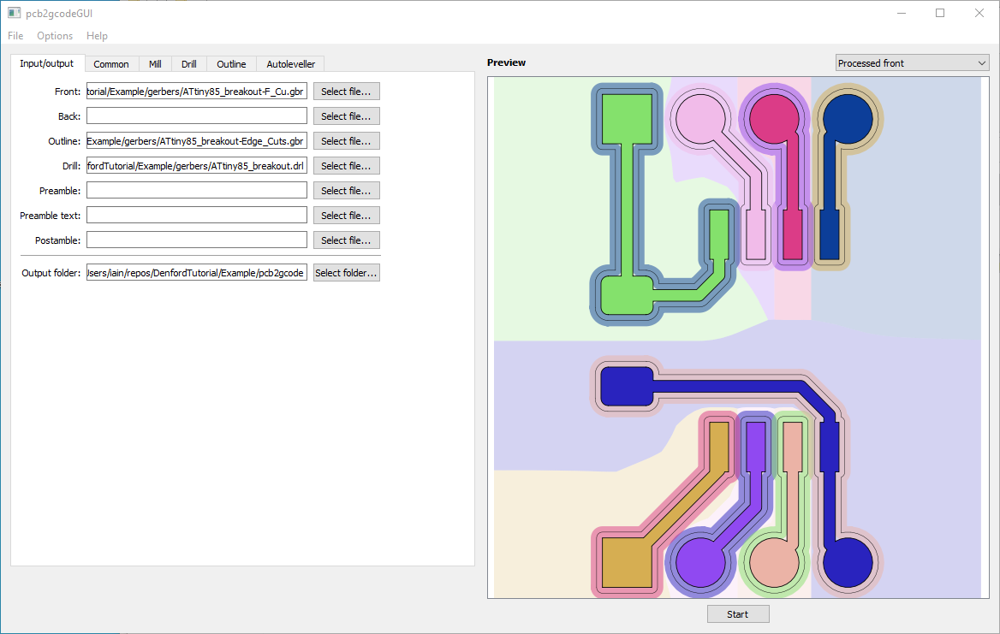
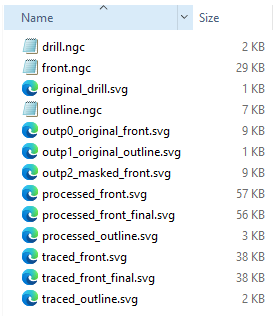
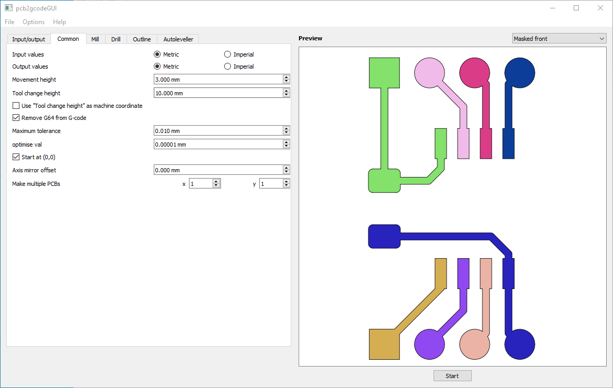
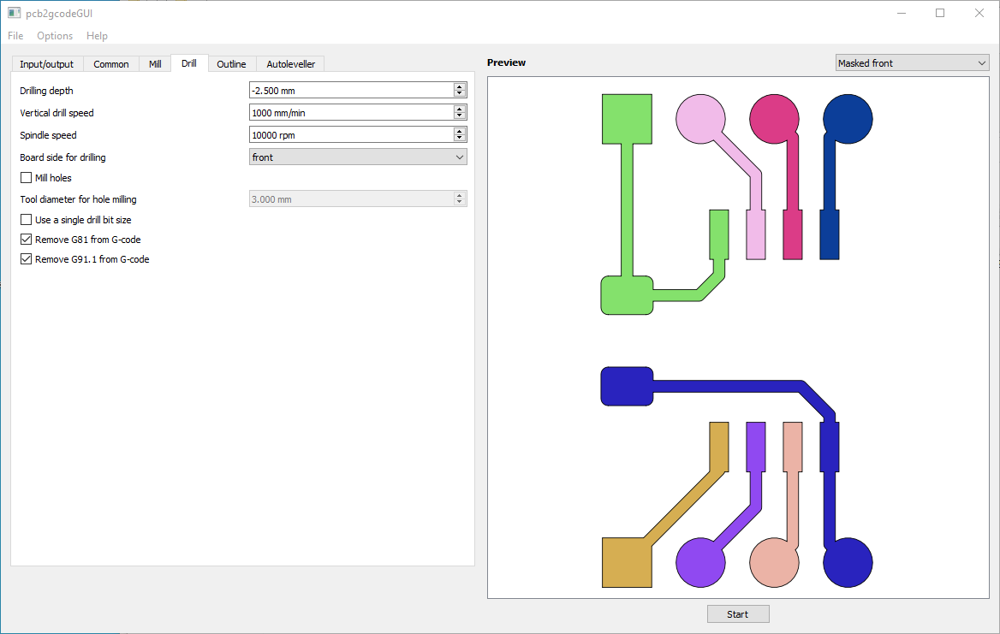
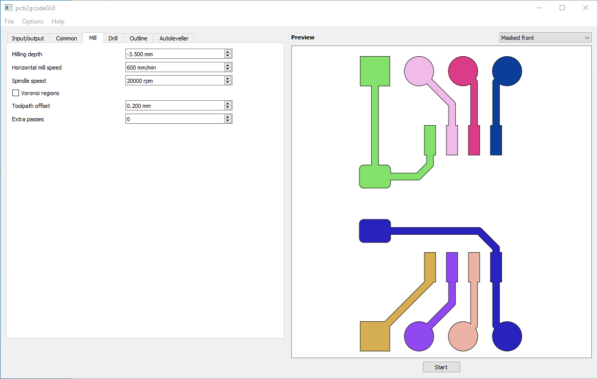
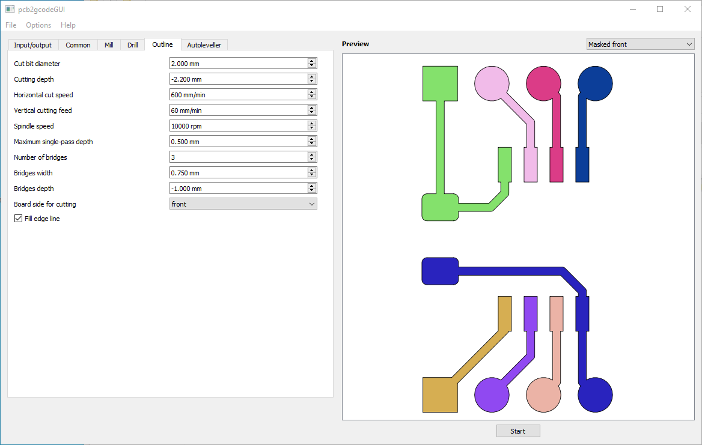

# Turning Gerbers Into GCode

To turn our gerber files into GCode that can be used to drive the engraver, we're going to use [pcb2gcode](https://github.com/pcb2gcode/pcb2gcode) with its graphical wrapper [pcb2gcodeGUI](https://github.com/pcb2gcode/pcb2gcodeGUI). In the FabLab@Strathclyde, this should be installed on Laptop 1 in `C:\pcb2gcode`.

When your first open the program, you need to import the settings for the Denford. To do this, go to `File->Load configuration file` and choose the [Denford_pcb2gcode.settings](/Denford_pcb2gcode.settings) file included with this tutorial.

In the `Input/output` tab, select the gerbers you generated in the previous step. If you used the default KiCAD naming, your `Front` will be the file that ends in `-F_Cu.gbr`, `Outline` will be the file that ends in `-Edge_Cuts.gbr` and the `Drill` file will end in `.drl`.

One you have these files selected you should get a preview of the PCB as shown below.

Once you choose a directory for the output files, you should just be able to hit `Start`. Assuming your design doesn't have any problems, you should see output similar to the below.

The preview window will now update to show the processed front. If there were any problems in the output generation, the preview can help you identify them. Note that where there is insufficient clearance between traces, pcb2gcdoe will default to trying to mill between the traces. This can lead to your traces being too thin, so it's better to fix problems in the design.

The output directory should now have a list of files similar to the one shown below. The three files we are most insterested in are the `.ngc` files, as these contain the GCode we will use to drive the Denford.

## Manual pcb2gcode Settings

### Common

### Drill

### Mill

### Outline

___
  <[Previous](kicadgerbers.md) | [Index](index.md) | [Next](milling.md)>
